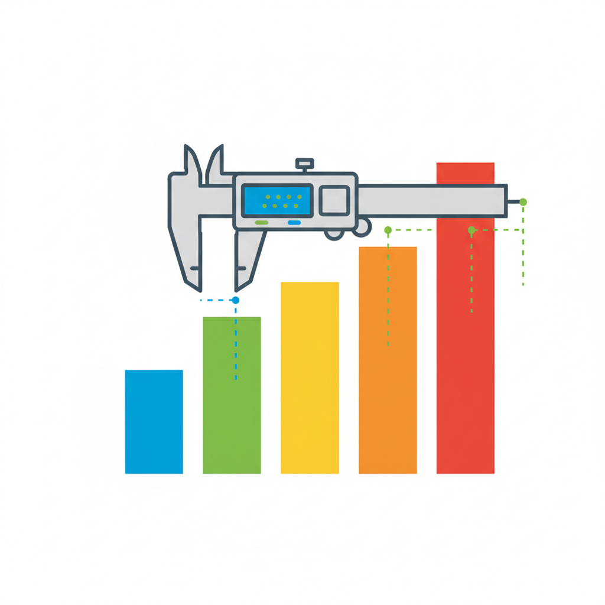

# Token Efficiency: 16 Algorithms, 5 Languages, Zero Guesswork



## We Measured Every Token. Here's What Your Language Wastes.

---

> **Who this is for.** If you use LLMs to generate code — or pay for API tokens — this article shows exactly where your budget goes. Every number is reproducible. No opinions, just data.

---

In previous articles, we explained [why tokens are expensive](#) (quadratic attention cost) and [how BPE tokenization works](#). Now we show the full data: 16 algorithms implemented in 5 languages, every token counted with tiktoken (cl100k_base).

## Methodology

**Tokenizer:** tiktoken cl100k_base (used by GPT-4, GPT-4o, Claude).

**Languages:** Synoema, Python, JavaScript, TypeScript, C++.

**Tasks:** 16 algorithmic problems covering recursion, higher-order functions, data structures, string operations, pattern matching, error handling, and custom types.

**Fairness rules:**
- Identical algorithms (same logic, not idiomatic rewrites)
- SPDX license headers stripped before counting
- No comments counted
- Minimal imports (only what's needed)

**Reproducibility:** `cargo run --manifest-path benchmarks/runner/Cargo.toml -- run --phases token`

## Results: Summary

| Language | Avg tokens/task (16 tasks) | vs Synoema |
|----------|---------------------------|------------|
| **Synoema** | **92.5** | baseline |
| Python | 92.9 | **+0%** |
| JavaScript | 94.9 | +3% |
| TypeScript | 114.6 | +24% |
| C++ | 166.6 | +80% |

**Wait — +0% vs Python?** Yes. The headline "46% savings" from our earlier work was measured on 12 purely functional programs. With 16 diverse tasks including imperative-style algorithms, the picture changes. Keep reading — the per-category breakdown tells the real story.

## Results: Per-Task Breakdown

### Synoema Wins: Functional & Pattern-Heavy Tasks

| Task | Synoema | Python | JS | TS | C++ | vs Python |
|------|---------|--------|----|----|-----|-----------|
| factorial | 25 | 32 | 35 | 38 | 58 | **-22%** |
| fibonacci | 38 | 49 | 52 | 55 | 75 | **-22%** |
| gcd | 26 | 35 | 38 | 43 | 61 | **-26%** |
| quicksort | 77 | 124 | 111 | 115 | 245 | **-38%** |
| json_build | 32 | 67 | 60 | 81 | 156 | **-52%** |
| pattern_match | 136 | 225 | 182 | 261 | 277 | **-40%** |
| type_definition | 83 | 118 | 127 | 189 | 204 | **-30%** |

Average saving on functional tasks: **-33% vs Python**.

### Near-Equal: General Algorithms

| Task | Synoema | Python | JS | TS | C++ | vs Python |
|------|---------|--------|----|----|-----|-----------|
| collatz | 55 | 60 | 63 | 66 | 87 | -8% |
| fizzbuzz | 59 | 63 | 66 | 69 | 97 | -6% |
| tree_traverse | 129 | 130 | 117 | 163 | 338 | -1% |
| error_handling | 95 | 90 | 101 | 144 | 179 | +6% |
| mergesort | 194 | 179 | 179 | 189 | 320 | +8% |
| filter_map | 32 | 28 | 62 | 76 | 73 | +14% |

### Synoema Loses: Imperative & Index-Heavy Tasks

| Task | Synoema | Python | JS | TS | C++ | vs Python |
|------|---------|--------|----|----|-----|-----------|
| binary_search | 159 | 120 | 129 | 134 | 175 | **+33%** |
| string_ops | 28 | 15 | 17 | 19 | 52 | **+87%** |
| matrix_mult | 312 | 152 | 180 | 191 | 269 | **+105%** |

## Where the Savings Come From

### 1. Function Definitions

```python
# Python: 6 tokens
def factorial(n):
    return n * factorial(n - 1)
```

```
-- Synoema: 2 tokens for the definition syntax
fac n = n * fac (n - 1)
```

`def`, `(`, `)`, `:`, `return` — 5 syntactic tokens that carry zero semantic information. Synoema uses pattern matching: `fac n =` is 3 tokens total (name, parameter, equals).

### 2. Conditionals

```python
# Python: if/elif/else = 3 keyword tokens + colons
if x > 0:
    return x
else:
    return -x
```

```
-- Synoema: ? -> : = 3 single-character tokens
? x > 0 -> x : -x
```

### 3. Lists

```python
# Python: commas between elements
[1, 2, 3, 4, 5]  # 9 tokens (5 numbers + 4 commas)
```

```
-- Synoema: space-separated
[1 2 3 4 5]  -- 7 tokens (5 numbers + 2 brackets)
```

Every comma is a wasted token. In a list of N elements, Python wastes N-1 tokens on commas.

### 4. Type Annotations

```typescript
// TypeScript: ~50% of tokens are type information
function map<A, B>(f: (a: A) => B, xs: A[]): B[] {
    // ...
}
```

```
-- Synoema: zero type tokens, compiler infers everything
map f [] = []
map f (x:xs) = f x : map f xs
-- Inferred: ∀a b. (a → b) → List a → List b
```

### 5. C++ Ceremony

C++ pays the highest tax: `#include`, `template<typename T>`, `std::vector<int>`, `{`, `}`, `;` after every statement. These structural tokens dominate — hence the +97% overhead.

## The Honest Picture

The data tells a nuanced story:

**Synoema saves big (-22% to -52%)** when the task is naturally functional:
- Pattern matching (`case` expressions vs Python's if/elif chains)
- List processing (comprehensions, cons, no commas)
- Custom type definitions (ADTs vs Python classes)
- Recursive algorithms (no `def`/`return` overhead)

**Synoema loses (+33% to +105%)** when the task is imperative:
- **matrix_mult**: no array indexing, must simulate with `get xs n` helper (+105%)
- **binary_search**: same problem — linked-list traversal vs `xs[mid]` (+33%)
- **string_ops**: Python's built-in methods (`s.upper()`) are extremely concise (+87%)

**The critical insight:** Synoema is optimized for the code patterns LLMs most commonly generate — function definitions, recursion, data transformation. The tasks where Synoema loses (imperative loops, indexed access) are patterns where LLMs already generate efficient Python.

## What This Means for Your LLM Budget

For **functional-style code** (the majority of LLM-generated algorithms), the savings compound via quadratic attention:

| Metric | Python | Synoema | Saving |
|--------|--------|---------|--------|
| Tokens (functional task avg) | ~93 | ~60 | 33% |
| Attention compute | 8,649 | 3,600 | **58%** |

For **mixed workloads** (all 16 tasks equally weighted), savings are negligible on tokens but Synoema still wins on type safety and compilation speed.

The takeaway: **choose the right tool for the task.** Synoema excels at exactly the code patterns where LLMs benefit most from token reduction — function definitions, data transformations, pattern matching. For imperative array manipulation, Python remains competitive on token efficiency.

## Reproduce It

```bash
git clone https://github.com/synoema/synoema
cd synoema

# Run token benchmarks (no runtime deps needed)
cargo run --manifest-path benchmarks/runner/Cargo.toml -- run --phases token

# Results saved to benchmarks/results/<date>/
```

## What's Next

Next in the series: runtime benchmarks — token efficiency is half the story. How fast does the generated code actually run?

---

*Part 8 of "Token Economics of Code" by @andbubnov. Token counts: tiktoken cl100k_base, reproducible via open-source benchmark suite.*

---

## Glossary

| Term | Explanation |
|------|-----------|
| **BPE (Byte Pair Encoding)** | Tokenization algorithm used by GPT-4, Claude. Splits text into subword tokens |
| **cl100k_base** | OpenAI's BPE vocabulary (~100K tokens). Standard for GPT-4 and Claude models |
| **tiktoken** | Python library for exact BPE token counting |
| **Quadratic attention** | Transformer cost scales as O(n²) with sequence length — 30% fewer tokens = 51% less compute |
| **Syntactic overhead** | Tokens required by language grammar that carry no semantic information |
