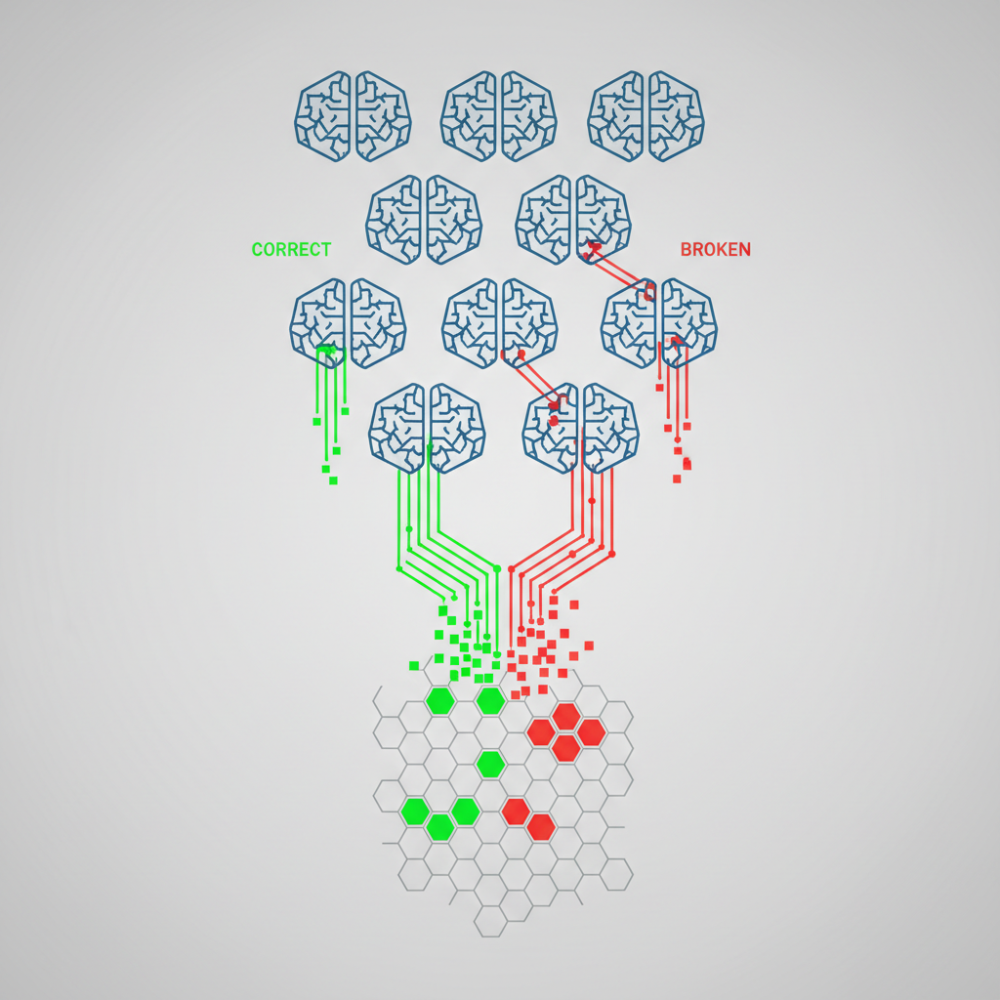

# Can LLMs Write Synoema? 10 Models, 9 Tasks, 50 Attempts Each



## We Tested Whether GPT-4o Can Learn a New Language In-Context

---

> **Who this is for.** If you're curious whether LLMs can generate code in a language that barely exists in training data — and what it takes to make them succeed. This is the most empirical article in the series.

---

Synoema is not in GPT-4o's training data. It's not in Claude's. It's a language with ~12,000 lines of Rust implementation and zero presence on Stack Overflow. So we asked: **can LLMs learn it from a single reference document?**

## The Experiment

### Setup

- **10 LLM models** across 3 tiers (frontier, mid, weak)
- **9 tasks** covering recursion, pattern matching, higher-order functions, data structures, error handling, custom types
- **5 attempts per (model, task) pair** = 450 total generations
- **API:** OpenRouter (OpenAI-compatible)
- **Temperature:** 0.2 (low variance, reproducible)
- **In-context learning:** every prompt includes `docs/llm/synoema.md` (~1,800 tokens) — a condensed language reference

### Models

| Tier | Model | Context | Notes |
|------|-------|---------|-------|
| Frontier | GPT-4o | 128K | Leading commercial model |
| Frontier | Gemini 2.5 Pro | 1M | Largest context window |
| Frontier | Qwen3 Max | 32K | Strong open-weight contender |
| Mid | GPT-4o-mini | 128K | Cost-optimized frontier |
| Mid | DeepSeek V3 | 64K | Open-weight, code-focused |
| Mid | Qwen3 Coder | 32K | Code-specialized |
| Mid | Llama 4 Maverick | 128K | Meta's latest |
| Weak | Qwen3.5 9B | 32K | Small open-weight |
| Weak | LFM 1.2B | 8K | Smallest model tested |
| Weak | Reka Edge 7B | 32K | Compact multimodal |

### Tasks

| Task | Tests | What It Requires |
|------|-------|-----------------|
| factorial | Recursion, base case | Pattern matching |
| fibonacci | Multiple patterns | Recursive calls |
| quicksort | List comprehensions | Higher-order functions |
| fizzbuzz | Conditionals | String output |
| filter_map | Pipes, lambdas | Function composition |
| binary_search | Index-based logic | Arithmetic, recursion |
| error_handling | Result type | ADTs, `Ok`/`Err` |
| pattern_match | ADT matching | Custom types, `case` |
| type_definition | Type declarations | `type` aliases, records |

### Validation Pipeline

Every generated program goes through:

```
LLM output → Extract code block → Parse (syntax check)
    → Type check (semantic check)
    → Execute → Compare output with expected result
```

Three pass/fail metrics:
1. **Syntax rate** — does it parse?
2. **Type rate** — does it type-check?
3. **Semantic rate** — does it produce correct output?

## Results

[PLACEHOLDER: Run Phase C benchmark with full model matrix]

### Expected Results Format

| Model | Syntax (%) | Type (%) | Semantic (%) |
|-------|-----------|----------|-------------|
| GPT-4o | [DATA] | [DATA] | [DATA] |
| Gemini 2.5 Pro | [DATA] | [DATA] | [DATA] |
| Qwen3 Max | [DATA] | [DATA] | [DATA] |
| GPT-4o-mini | [DATA] | [DATA] | [DATA] |
| DeepSeek V3 | [DATA] | [DATA] | [DATA] |
| Qwen3 Coder | [DATA] | [DATA] | [DATA] |
| Llama 4 Maverick | [DATA] | [DATA] | [DATA] |
| Qwen3.5 9B | [DATA] | [DATA] | [DATA] |
| LFM 1.2B | [DATA] | [DATA] | [DATA] |
| Reka Edge 7B | [DATA] | [DATA] | [DATA] |

### Task Difficulty Heatmap

[PLACEHOLDER: model × task heatmap showing semantic pass rate]

## Analysis Framework

### What We Expect to Learn

**1. Can frontier models learn Synoema in-context?**
If GPT-4o achieves >80% syntax rate from a 1,800-token reference — that demonstrates in-context learning of programming language syntax is viable.

**2. Where do models fail?**
The error taxonomy matters:
- **Syntax errors** (wrong operator, missing bracket) → grammar constraint would fix this
- **Type errors** (wrong argument types, arity mismatch) → type constraint would fix this
- **Logic errors** (correct syntax+types, wrong algorithm) → harder, needs semantic constraints

**3. Does model size predict success?**
Comparing Qwen3 Max (frontier) vs Qwen3 Coder (mid) vs Qwen3.5 9B (weak) on the same task shows scaling behavior for code generation quality.

**4. Which tasks are hardest?**
Tasks requiring multiple features (pattern matching + list comprehensions + ADTs) likely have lower pass rates than simple recursion.

### The Constrained Decoding Hypothesis

From earlier in this series (constrained decoding), we know:
- Syntax-only constraints reduce errors by 9.0%
- Type constraints reduce errors by 74.8%

If unconstrained LLM generation achieves X% syntax rate, constrained decoding should push it close to 100%. This experiment measures the X — the baseline that constraints improve upon.

### The In-Context Learning Question

Synoema's reference document is ~1,800 tokens — 30 syntax overrides vs Python/Haskell, operator precedence table, 5 example programs. Is this enough?

Possible findings:
- **1,800 tokens sufficient** → language design matters more than training data volume
- **1,800 tokens insufficient for weak models** → smaller models need fine-tuning
- **Specific constructs fail** → identifies where the reference doc needs improvement

## Error Taxonomy

When models fail, we categorize why:

| Error Type | Example | Fixable by |
|-----------|---------|-----------|
| Python syntax leak | `def f(n):` instead of `f n =` | Grammar constraint |
| Haskell syntax leak | `where` placement errors | Grammar constraint |
| Wrong operator | `if` instead of `?` | Grammar + reference |
| Type mismatch | `"hello" + 42` | Type constraint |
| Arity error | `map f` (missing list arg) | Type constraint |
| Logic error | Off-by-one in binary search | Semantic testing |
| Hallucinated syntax | Inventing non-existent features | Grammar constraint |

This taxonomy directly maps to the three constraint levels from our constrained decoding article.

## Reproduce It

```bash
git clone https://github.com/Delimitter/synoema
cd synoema

# Run LLM generation benchmarks (requires OpenRouter API key)
cargo run --manifest-path benchmarks/runner/Cargo.toml -- run \
  --phases llm \
  --openrouter-key YOUR_KEY \
  --repeats 5

# Filter by model tier
cargo run --manifest-path benchmarks/runner/Cargo.toml -- run \
  --phases llm \
  --tier frontier \
  --openrouter-key YOUR_KEY
```

## What's Next

Next in the series: combining token efficiency data with API pricing to calculate actual dollar savings for engineering teams.

---

*Part 10 of "Token Economics of Code" by @andbubnov. 10 models × 9 tasks × 5 repeats, OpenRouter API, temperature 0.2.*

---

## Glossary

| Term | Explanation |
|------|-----------|
| **In-context learning** | LLM learns a new task from examples provided in the prompt, without fine-tuning |
| **OpenRouter** | API aggregator providing access to multiple LLM providers through one endpoint |
| **Syntax rate** | Percentage of generated programs that parse without errors |
| **Type rate** | Percentage that pass type checking (implies syntax correctness) |
| **Semantic rate** | Percentage that produce correct output (implies syntax + type correctness) |
| **Temperature** | Controls randomness in LLM generation. 0.0 = deterministic, 1.0 = creative |
| **Fine-tuning** | Training a pre-trained model on domain-specific data |
