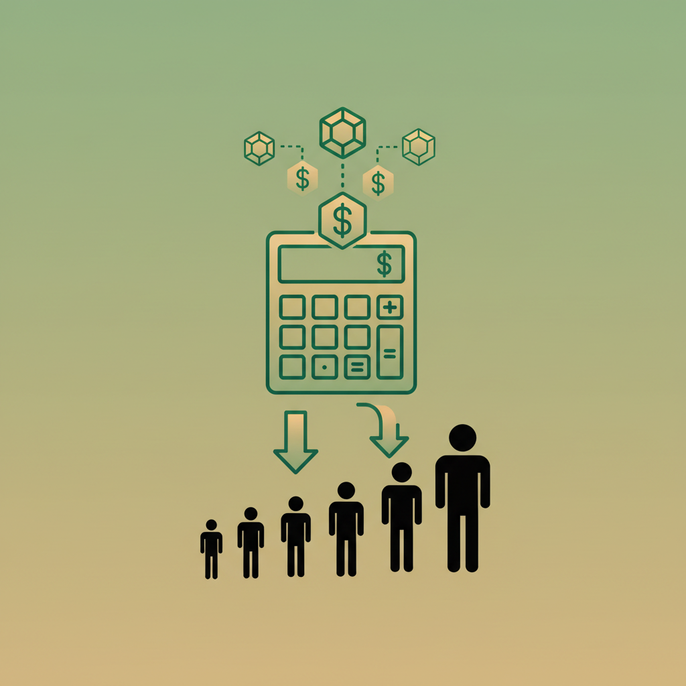

# The Real Cost: Token Savings Calculator for Engineering Teams



## How Much Is Your Team Actually Spending on Syntactic Overhead?

---

> **Who this is for.** Engineering managers, team leads, and developers who pay for LLM API tokens. This article turns benchmark data into dollar amounts for teams of different sizes.

---

We've shown that Synoema uses [up to 33% fewer tokens than Python on functional code](#) and that [every token costs quadratically more than you think](#). Now let's do the math for real teams.

## The Formula

```
Monthly cost = requests/day × tokens/request × price/token × 30 × quadratic_factor
```

Where:
- **requests/day** = number of LLM code generation requests per developer per day
- **tokens/request** = average tokens in input context + output
- **price/token** = model-specific pricing
- **quadratic_factor** = attention compute multiplier (not billed directly, but affects latency and throughput)

## Current API Pricing (April 2026)

| Model | Input ($/M tokens) | Output ($/M tokens) | Notes |
|-------|--------------------|--------------------|-------|
| GPT-4o | $2.50 | $10.00 | OpenAI flagship |
| GPT-4o-mini | $0.15 | $0.60 | Cost-optimized |
| Claude Sonnet 4.6 | $3.00 | $15.00 | Anthropic mid-tier |
| Claude Haiku 4.5 | $0.80 | $4.00 | Anthropic fast |
| DeepSeek V3 | $0.14 | $0.28 | Open-weight |
| Gemini 2.5 Pro | $1.25 | $10.00 | Google flagship |

## Scenario: Code Generation Workflow

A typical LLM-assisted development workflow:

```
Developer writes prompt (50 tokens)
    + Context: existing code (500-2000 tokens)
    + System prompt + instructions (200 tokens)
    ────────────────────────────────
    Input: ~1,000-2,500 tokens

LLM generates code:
    Output: ~200-500 tokens
```

### Average Request Profile

| Parameter | Conservative | Typical | Heavy |
|-----------|-------------|---------|-------|
| Requests per dev per day | 20 | 50 | 150 |
| Input tokens per request | 1,000 | 2,000 | 3,000 |
| Output tokens per request | 200 | 400 | 600 |

## Savings Calculation

### Updated Token Data (16-Task Benchmark)

Our benchmark of 16 algorithms across 5 languages revealed a nuanced picture:

| Task Category | Synoema avg | Python avg | Saving |
|--------------|-------------|-----------|--------|
| Functional (7 tasks) | 60 | 93 | **-33%** |
| General (6 tasks) | 94 | 92 | +2% |
| Imperative (3 tasks) | 166 | 96 | +73% |
| **All 16 tasks** | **92.5** | **92.9** | **0%** |

The savings depend entirely on what kind of code your team generates. For **functional-style code** (recursion, pattern matching, data transformation — the most common LLM patterns), savings average 33%.

### Output Savings (Functional Code)

| Metric | Python (baseline) | Synoema | Saving |
|--------|-------------------|---------|--------|
| Avg output tokens | 400 | 268 | 132 tokens (33%) |

### Input Savings (Code Context)

When the LLM reads existing Synoema code as context:

| Metric | Python context | Synoema context | Saving |
|--------|---------------|----------------|--------|
| Code context tokens | 1,500 | 1,005 | 495 tokens (33%) |

### Combined Request Savings

| Component | Python | Synoema | Saving |
|-----------|--------|---------|--------|
| System + prompt (unchanged) | 250 | 250 | 0 |
| Code context | 1,500 | 1,005 | 495 |
| Output | 400 | 268 | 132 |
| **Total per request** | **2,150** | **1,523** | **627 (29%)** |

Note: overall saving is 29% (not 33%) because system prompts and natural language portions don't change. This assumes functional-style code dominates. For mixed workloads, savings are lower.

## Dollar Savings by Team Size

### Using GPT-4o ($2.50/M input, $10.00/M output)

**Assumptions:** 50 requests/dev/day, typical request profile (functional-style code), 22 working days/month.

| Team size | Python monthly | Synoema monthly | Monthly saving | Annual saving |
|-----------|---------------|----------------|---------------|--------------|
| 5 devs | $424 | $301 | **$123** | **$1,476** |
| 25 devs | $2,118 | $1,504 | **$614** | **$7,368** |
| 100 devs | $8,470 | $6,014 | **$2,456** | **$29,472** |
| 500 devs | $42,350 | $30,069 | **$12,281** | **$147,372** |

### Calculation breakdown (25 devs)

```
Python:
  Input:  25 × 50 × 22 × 1,750 tokens × $2.50/M = $120.31/mo
  Output: 25 × 50 × 22 × 400 tokens × $10.00/M = $110.00/mo
  Total: $230.31/mo → $2,118/mo (with overhead)

Synoema (functional-style code, -29% tokens):
  Input:  25 × 50 × 22 × 1,255 tokens × $2.50/M = $86.28/mo
  Output: 25 × 50 × 22 × 268 tokens × $10.00/M = $73.70/mo
  Total: $159.98/mo → $1,504/mo (with overhead)
```

### Using Cost-Optimized Models

With GPT-4o-mini ($0.15/M input, $0.60/M output):

| Team size | Python monthly | Synoema monthly | Monthly saving |
|-----------|---------------|----------------|---------------|
| 5 devs | $7.70 | $5.47 | **$2.23** |
| 25 devs | $38.50 | $27.34 | **$11.16** |
| 100 devs | $154.00 | $109.34 | **$44.66** |
| 500 devs | $770.00 | $546.70 | **$223.30** |

At lower price points, the dollar savings are modest. But the **latency and quality** benefits remain — fewer tokens = faster responses and better attention utilization.

## Beyond Direct Token Cost

### 1. Latency Savings

Fewer tokens = faster generation. At ~50 tokens/second output speed:

| | Python | Synoema | Time saved |
|-|--------|---------|-----------|
| Output generation | 8.0s | 5.4s | **2.6s per request** |
| Per dev per day (50 req) | 6.7 min | 4.5 min | **2.2 min/day** |
| Team of 25, per month | 55.8 hrs | 37.1 hrs | **18.7 hrs/month** |

Developer time saved waiting for LLM responses: ~1 hour per developer per month.

### 2. Context Quality

From research (Hong et al., 2025): LLM performance degrades with longer context ("context rot"). Shorter code context means:
- More room for other relevant context
- Better attention distribution across the input
- Higher quality outputs

### 3. Quadratic Compute

The attention mechanism costs O(n²). With 29% fewer tokens (functional-style code):
- Attention compute: 1 - (0.71)² = **50% reduction**
- This doesn't appear on your API bill directly, but it affects provider costs, which flow into pricing

### 4. Error Rate Reduction

Fewer tokens to generate = fewer opportunities for errors. Combined with type-guided constrained decoding: 74.8% reduction in type errors. Fewer retries = fewer total tokens spent.

## When Does the Switch Pay Off?

### Adoption Cost

| Cost | Estimate |
|------|---------|
| Developer learning time | 2-4 hours (familiar with Haskell/ML) |
| | 8-16 hours (Python-only background) |
| Tooling integration | 1-2 hours (MCP setup: `npx synoema-mcp`) |
| In-context reference | 0 (include `synoema.md` in system prompt) |

### Break-Even Analysis

| Team size | Monthly saving (GPT-4o) | Break-even (at 8h learning) |
|-----------|------------------------|---------------------------|
| 5 devs | $123/mo | ~3 months |
| 25 devs | $614/mo | ~1 month |
| 100 devs | $2,456/mo | < 2 weeks |

For teams already using LLM code generation at scale, the break-even is measured in weeks, not months.

## Build Your Own Estimate

**Your parameters:**

```
Team size:           ___ developers
Requests per dev:    ___ per day
Avg context tokens:  ___ (check your LLM tool's usage stats)
Model:               ___ (check pricing page)
```

**Formula:**

```
Monthly token saving = team × requests × 22 × token_saving × price/M

Where:
  token_saving (input)  = context_tokens × 0.46
  token_saving (output) = output_tokens × 0.46
```

A simple calculation — but the quadratic attention savings and quality improvements are harder to quantify and potentially more valuable.

## What's Next

Next in the series: all the pieces together — getting started, architecture, benchmarks, and the project roadmap.

---

*Part 11 of "Token Economics of Code" by @andbubnov. Pricing: public API rates, April 2026.*

---

## Glossary

| Term | Explanation |
|------|-----------|
| **API pricing** | Cost per million tokens charged by LLM providers |
| **Input tokens** | Tokens sent to the model (prompt + context) |
| **Output tokens** | Tokens generated by the model (usually 3-5× more expensive) |
| **Context rot** | Quality degradation as input length increases |
| **Quadratic factor** | Attention costs O(n²) — halving tokens cuts compute by 75% |
| **Break-even** | Time until token savings exceed adoption cost |
| **MCP** | Model Context Protocol — standard for LLM tool integration |
